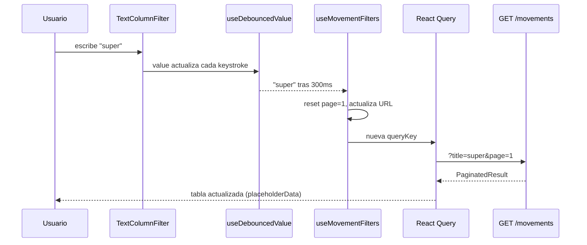
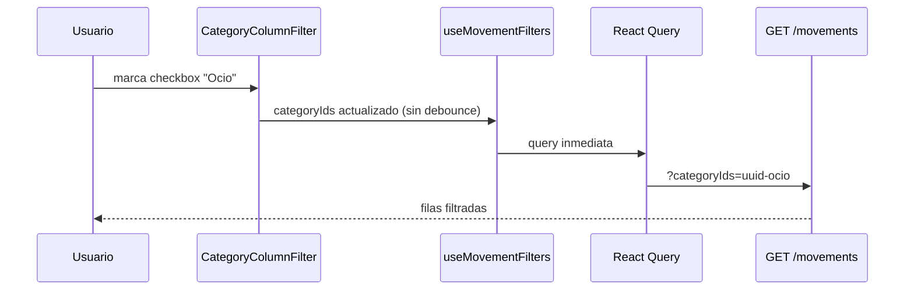

# Plan: tabla reutilizable con filtros y vista de movimientos

> **Objetivo:** separar la tabla del home (resumen) de una vista completa `/dashboard/movements` con filtros por columna, ordenación y búsqueda server-side optimizada.
>
> **Referencia de contexto:** `@docs/cerbero-context.md` · **Estado actual:** Jul 2026

---

## Resumen ejecutivo

| Vista | Ruta | Comportamiento |
|---|---|---|
| Resumen (actual) | `/dashboard` | Últimas ~5–8 transacciones, sin filtros, botón **Ver todo** |
| Listado completo | `/dashboard/movements` | Tabla grande con filtros, ordenación y paginación |

La tabla del home se mantiene visualmente similar pero pasa a ser un **widget de resumen**. La lógica reutilizable vive en un componente genérico `DataTable` que cualquier feature podrá usar con distintas columnas y tipos de filtro.

---

## Estado actual (lo que ya tenemos)

### API — `GET /movements`

Filtros soportados hoy (`apps/api/src/services/movements.ts`):

| Query param | Tipo | Notas |
|---|---|---|
| `type` | `expense` \| `income` | ✅ |
| `categoryId` | UUID | Solo **una** categoría |
| `from` / `to` | `YYYY-MM-DD` | Sobre campo `date` del movimiento |
| `page` / `pageSize` | number | Paginación ✅ |
| `limit` | number | Solo en listado no paginado |

**No soportado aún:** búsqueda por texto (`title`, `comment`, `customCategory`), múltiples categorías, ordenación dinámica, rango de cantidad.

Orden fijo en repositorio: `date DESC`, `created_at DESC`.

### Dashboard

| Archivo | Rol |
|---|---|
| `features/dashboard/components/movement-table.tsx` | Tabla actual (paginada, sin filtros) |
| `features/dashboard/components/movement-table-row.tsx` | Fila con grid CSS 1:1:2:2 |
| `features/movements/api.ts` | Solo envía `page` y `pageSize` |
| `features/movements/hooks.ts` | `useMovements`, `useMonthSummary` |

### Modelo `Movement` (`packages/shared`)

```ts
date: string;        // fecha del gasto/ingreso (YYYY-MM-DD)
createdAt: string;   // cuándo se registró en Cerbero (ISO)
```

La nueva columna **Fecha** mostrará `createdAt` (cuándo se añadió). Opcionalmente se puede añadir tooltip con `date` si difiere.

---

## Arquitectura propuesta

```
apps/dashboard/
├── components/
│   └── data-table/
│       ├── data-table.tsx              # Shell genérico (header, body, paginación)
│       ├── data-table-header-cell.tsx  # Título + dropdown filtro/orden
│       ├── filters/
│       │   ├── text-column-filter.tsx       # input + debounce
│       │   ├── category-column-filter.tsx   # checkboxes + sección "Otros"
│       │   └── sort-controls.tsx            # asc/desc según tipo columna
│       └── types.ts
├── features/
│   ├── movements/
│   │   ├── components/
│   │   │   ├── movements-page.tsx           # Página /dashboard/movements
│   │   │   ├── movements-table.tsx          # Config de columnas para DataTable
│   │   │   └── movement-table-row.tsx       # (mover desde dashboard/)
│   │   ├── hooks/
│   │   │   ├── use-movements.ts             # query con todos los filtros
│   │   │   └── use-movement-filters.ts      # estado filtros + URL sync
│   │   └── api.ts                           # ampliar params
│   └── dashboard/
│       └── components/
│           ├── movement-summary-table.tsx     # Tabla compacta del home
│           └── dashboard-home.tsx             # usa summary + link "Ver todo"
└── lib/
    └── hooks/
        └── use-debounced-value.ts
```

### Principio de diseño

`DataTable<T>` es **agnóstico de la entidad**. Recibe:

```ts
type SortType = "alpha" | "numeric" | "date";
type FilterType = "none" | "text" | "category" | "number" | "date";

type DataTableColumn<T> = {
  id: string;
  header: string;
  sortable?: boolean;
  sortType?: SortType;
  filterType?: FilterType;
  className?: string;           // celda grid (ej. justify-self-center)
  hidden?: "sm" | "md";         // responsive
  cell: (row: T) => React.ReactNode;
};

type DataTableProps<T> = {
  columns: DataTableColumn<T>[];
  data: T[];
  loading?: boolean;
  error?: boolean;
  pagination: { page: number; totalPages: number; onPageChange: (p: number) => void };
  filters: Record<string, unknown>;       // estado actual
  onFilterChange: (columnId: string, value: unknown) => void;
  onSortChange: (columnId: string, order: "asc" | "desc" | null) => void;
  sort?: { columnId: string; order: "asc" | "desc" };
  emptyMessage?: React.ReactNode;
};
```

La feature `movements` define las columnas concretas; `DataTable` solo renderiza UI y emite eventos.

---

## Fase 1 — Extender API (backend)

**Prioridad:** hacer esto primero; el frontend depende de estos query params.

### 1.1 Nuevos filtros en `MovementFilters`

Archivos a tocar:

- `apps/api/src/types/index.ts`
- `apps/api/src/services/movements.ts` (schema Zod)
- `apps/api/src/controllers/movements.ts` (leer query params)
- `apps/api/src/repositories/movements.ts` (aplicar en Supabase)

| Query param | Tipo | Comportamiento en Supabase |
|---|---|---|
| `title` | string | `.ilike("title", `%${value}%`)` |
| `comment` | string | `.ilike("comment", `%${value}%`)` |
| `categoryIds` | string (CSV UUIDs) | `.in("category_id", ids)` |
| `customCategory` | string | `.ilike("custom_category", `%${value}%`)` |
| `includeCustom` | boolean | `.not("custom_category", "is", null)` cuando true sin texto |
| `minAmount` | number | `.gte("amount", value)` |
| `maxAmount` | number | `.lte("amount", value)` |
| `sortBy` | enum | Ver tabla abajo |
| `sortOrder` | `asc` \| `desc` | Default `desc` |

**`sortBy` permitidos:**

| Valor | Campo DB | Tipo orden |
|---|---|---|
| `category` | join lógico vía `category_id` + `custom_category` | alpha (ver nota) |
| `amount` | `amount` | numeric |
| `title` | `title` | alpha |
| `comment` | `comment` | alpha |
| `createdAt` | `created_at` | date |
| `date` | `date` | date |

> **Nota categoría:** Supabase no ordena fácil por nombre de categoría sin join. Opciones:
> 1. **MVP:** ordenar por `category_id` + `custom_category` (suficiente para v1).
> 2. **Mejora:** vista SQL o RPC con join a `categories.name`.

### 1.2 Validación Zod

```ts
const movementFiltersSchema = z.object({
  // ...existentes
  title: z.string().trim().min(1).max(100).optional(),
  comment: z.string().trim().min(1).max(200).optional(),
  categoryIds: z
    .string()
    .transform((s) => s.split(",").filter(Boolean))
    .pipe(z.array(z.string().uuid()).min(1))
    .optional(),
  customCategory: z.string().trim().min(1).max(50).optional(),
  includeCustom: z.coerce.boolean().optional(),
  minAmount: z.coerce.number().positive().optional(),
  maxAmount: z.coerce.number().positive().optional(),
  sortBy: z
    .enum(["amount", "title", "comment", "createdAt", "date", "category"])
    .optional(),
  sortOrder: z.enum(["asc", "desc"]).optional(),
});
```

### 1.3 Tests manuales API

```bash
# Título contiene "super"
GET /movements?title=super&page=1&pageSize=10

# Varias categorías + otros con texto
GET /movements?categoryIds=uuid1,uuid2&includeCustom=true&customCategory=regalo

# Ordenar por cantidad ascendente
GET /movements?sortBy=amount&sortOrder=asc
```

### 1.4 (Opcional) Tipos compartidos

Añadir en `packages/shared/src/types/movement-filters.ts` y exportar desde `index.ts` para que dashboard y API compartan el contrato.

---

## Fase 2 — Hooks y cliente API (dashboard)

### 2.1 `useDebouncedValue`

```ts
// lib/hooks/use-debounced-value.ts
export function useDebouncedValue<T>(value: T, delay = 300): T
```

Usar en filtros de texto (`title`, `comment`, texto de "Otros").

### 2.2 Ampliar `getMovements`

```ts
export type MovementQueryParams = {
  page?: number;
  pageSize?: number;
  title?: string;
  comment?: string;
  categoryIds?: string[];
  customCategory?: string;
  includeCustom?: boolean;
  minAmount?: number;
  maxAmount?: number;
  sortBy?: string;
  sortOrder?: "asc" | "desc";
  from?: string;
  to?: string;
  type?: "expense" | "income";
};
```

Serializar `categoryIds` como CSV en la URL.

### 2.3 `useMovementFilters`

Estado central de filtros con **sincronización en URL** (`useSearchParams` + `useRouter`):

- Ventaja: filtros compartibles, back/forward del navegador funciona.
- Al cambiar cualquier filtro → resetear `page` a 1.
- Separar estado **inmediato** (checkboxes) vs **debounced** (texto).

```ts
const { filters, setFilter, setSort, clearFilters } = useMovementFilters();

// Internamente:
// - titleInput (local, instantáneo en UI)
// - debouncedTitle → entra en queryKey de React Query
// - categoryIds (inmediato, sin debounce)
```

### 2.4 React Query

```ts
useQuery({
  queryKey: ["movements", debouncedFilters],
  queryFn: () => getMovements(accessToken, debouncedFilters),
  enabled: !!accessToken,
  placeholderData: keepPreviousData, // evita parpadeo al escribir
});
```

`keepPreviousData` (o `placeholderData` en v5) es clave para UX al debouncear.

---

## Fase 3 — Componente `DataTable` reutilizable

### 3.1 UI base (shadcn)

Instalar componentes que faltan:

```bash
cd apps/dashboard
npx shadcn@latest add popover checkbox dropdown-menu
```

### 3.2 Header con filtro por columna

Cada `DataTableHeaderCell`:

```
┌─────────────────────────┐
│ CATEGORÍA          [▼]  │  ← click abre Popover
├─────────────────────────┤
│ Ordenar                 │
│  ↑ A-Z   ↓ Z-A          │  (o ↑ menor / ↓ mayor según sortType)
├─────────────────────────┤
│ [filtro según tipo]     │
└─────────────────────────┘
```

Indicador visual cuando hay filtro activo: punto o icono `Filter` coloreado en el header.

### 3.3 Filtros por tipo de columna

| Columna | `filterType` | UI | Debounce |
|---|---|---|---|
| Categoría | `category` | Checkboxes (todas las de BD) + separador + checkbox "Otros" + input texto | Texto "Otros": 300ms. Checkboxes: inmediato |
| Cantidad | `number` | Solo ordenación en v1 (filtro min/max en v2 si hace falta) | — |
| Título | `text` | Input búsqueda | 300ms |
| Descripción | `text` | Input búsqueda | 300ms |
| Fecha | `none` o `date` | Solo ordenación en v1 | — |

#### `CategoryColumnFilter` — detalle

```
☑ Alimentación
☑ Transporte
☐ Ocio
...
─────────────────
☑ Otros
   [ buscar en categoría personalizada... ]
```

Lógica al aplicar:

- Si hay UUIDs marcados → `categoryIds=uuid1,uuid2`
- Si "Otros" marcado sin texto → `includeCustom=true`
- Si "Otros" + texto → `includeCustom=true&customCategory=texto`
- Si nada marcado → no enviar filtro de categoría (mostrar todas)

### 3.4 Grid responsive

Actual ratio 1:1:2:2 con 4 columnas. Con **Fecha** añadir quinta columna.

Propuesta ratio **1 : 1 : 2 : 2 : 1** (categoría, cantidad, título, descripción, fecha):

```ts
export const movementRowGridClass =
  "grid grid-cols-[minmax(0,1fr)_minmax(0,1fr)_minmax(0,2fr)_minmax(0,2fr)_minmax(0,1fr)] gap-x-4 px-4";
```

En móvil: ocultar descripción (`hidden md:block`) y fecha compacta (`hidden sm:block` o mostrar bajo título).

### 3.5 Formato fecha

Usar helper existente o ampliar `lib/format.ts`:

```ts
export function formatDateTime(iso: string): string {
  return new Intl.DateTimeFormat("es-ES", {
    day: "numeric",
    month: "short",
    year: "numeric",
  }).format(new Date(iso));
}
```

---

## Fase 4 — Configuración tabla de movimientos

### 4.1 Columnas (`movements-table.tsx`)

```ts
const movementColumns: DataTableColumn<Movement>[] = [
  {
    id: "category",
    header: "Categoría",
    sortable: true,
    sortType: "alpha",
    filterType: "category",
    className: "justify-self-center",
    cell: (m) => <CategoryCell movement={m} categories={categories} />,
  },
  {
    id: "amount",
    header: "Cantidad",
    sortable: true,
    sortType: "numeric",
    filterType: "number",
    cell: (m) => <AmountCell movement={m} />,
  },
  {
    id: "title",
    header: "Título",
    sortable: true,
    sortType: "alpha",
    filterType: "text",
    cell: (m) => <TitleCell movement={m} />,
  },
  {
    id: "comment",
    header: "Descripción",
    sortable: true,
    sortType: "alpha",
    filterType: "text",
    hidden: "md",
    cell: (m) => <CommentCell movement={m} />,
  },
  {
    id: "createdAt",
    header: "Fecha",
    sortable: true,
    sortType: "date",
    filterType: "none",
    cell: (m) => formatDateTime(m.createdAt),
  },
];
```

Mapeo `column.id` → query param API:

```ts
const SORT_FIELD_MAP: Record<string, string> = {
  category: "category",
  amount: "amount",
  title: "title",
  comment: "comment",
  createdAt: "createdAt",
};
```

---

## Fase 5 — Rutas y refactor del home

### 5.1 Nueva ruta

```
apps/dashboard/app/dashboard/movements/page.tsx
```

```tsx
export default async function MovementsPage() {
  // auth igual que dashboard/page.tsx
  return (
    <DashboardShell userEmail={user.email}>
      <MovementsPageContent />
    </DashboardShell>
  );
}
```

`MovementsPageContent` (client): título "Movimientos", breadcrumb o link "← Volver al dashboard", `MovementsTable` a altura completa.

### 5.2 Refactor tabla del home

Renombrar/adaptar `movement-table.tsx` → `movement-summary-table.tsx`:

| Prop | Valor home |
|---|---|
| `pageSize` | 5 u 8 (fijo) |
| Filtros | Deshabilitados |
| Paginación | Oculta si `totalPages <= 1` |
| Título card | "Últimas transacciones" |
| Acción header | Botón/link **Ver todo** → `/dashboard/movements` |

```tsx
<DashboardCard
  title="Últimas transacciones"
  action={
    <Link href="/dashboard/movements" className="text-sm text-primary hover:underline">
      Ver todo
    </Link>
  }
>
```

Reutilizar `MovementTableRow` para no duplicar celdas.

### 5.3 Navegación (opcional v1)

En `DashboardShell`, añadir link "Movimientos" en el header cuando estemos en rutas internas. No bloqueante para v1.

---

## Fase 6 — UX y rendimiento

### Debounce

| Acción | Delay | Motivo |
|---|---|---|
| Escribir en título/descripción/otros | 300ms | Reducir peticiones mientras se escribe |
| Checkbox categoría | 0ms | Selección discreta, una petición por click |
| Cambio de ordenación | 0ms | Acción única |
| Cambio de página | 0ms | — |

### Estados de carga

- **Primera carga:** skeleton o spinner centrado.
- **Refetch con filtros:** mantener filas anteriores (`placeholderData`) + opacidad reducida o spinner pequeño en la tabla.
- **Sin resultados con filtros activos:** mensaje distinto a "aún no tienes movimientos" → "Ningún movimiento coincide con los filtros" + botón limpiar filtros.

### Cancelación de peticiones

React Query cancela automáticamente queries obsoletas si cambia `queryKey` antes de que termine la anterior. Asegurar que `fetchApi` usa `AbortSignal` (mejora opcional en `lib/api/client.ts`).

---

## Orden de implementación (checklist para mañana)

### Bloque A — Backend (~1–2h)

- [ ] Extender `MovementFilters` + Zod + controller
- [ ] Implementar filtros en `findMovementsPaginated`
- [ ] Implementar `sortBy` / `sortOrder` dinámico
- [ ] Probar con curl / script manual

### Bloque B — Infra dashboard (~1h)

- [ ] `useDebouncedValue`
- [ ] Tipos `MovementQueryParams` en shared o movements
- [ ] Ampliar `getMovements` + `useMovements` con filtros
- [ ] `useMovementFilters` con URL sync

### Bloque C — DataTable (~2–3h)

- [ ] Instalar shadcn popover + checkbox
- [ ] `DataTable` + `DataTableHeaderCell`
- [ ] `TextColumnFilter` (debounced callback al padre)
- [ ] `CategoryColumnFilter`
- [ ] `SortControls`

### Bloque D — Integración movimientos (~1–2h)

- [ ] `movements-table.tsx` con config de columnas
- [ ] Columna `createdAt` en fila
- [ ] Página `/dashboard/movements`
- [ ] Refactor home → `movement-summary-table` + "Ver todo"
- [ ] Actualizar grid CSS a 5 columnas

### Bloque E — Pulido (~30min)

- [ ] Estados vacío / error / loading
- [ ] Indicador filtro activo en headers
- [ ] `bun run typecheck` en dashboard + api
- [ ] Probar flujo completo en local con `bun run dev`

---

## Commits sugeridos

Seguir estilo del repo (`feat:`, `refactor:`):

```
feat(api): add text search, multi-category and sort params to movements
feat(dashboard): add reusable DataTable with column filters
feat(dashboard): add movements page with server-side filtering
refactor(dashboard): convert home table to recent transactions summary
```

---

## Decisiones tomadas / fuera de scope v1

| Tema | Decisión v1 | Mejora futura |
|---|---|---|
| Filtro rango cantidad | Solo ordenar | min/max en dropdown |
| Filtro rango fechas | Solo ordenar por `createdAt` | `from`/`to` en UI de fecha |
| Ordenar por nombre categoría | Por `category_id` / `custom_category` | Join SQL con `categories.name` |
| Editar/borrar movimiento | No | Acciones en fila |
| Exportar CSV | No | — |
| Filtro tipo gasto/ingreso | API ya lo soporta | Toggle en UI si se necesita |

---

## Diagrama de flujo (filtro texto)



## Diagrama de flujo (filtro categoría)



---

## Archivos principales a crear/modificar

| Acción | Archivo |
|---|---|
| Modificar | `apps/api/src/types/index.ts` |
| Modificar | `apps/api/src/services/movements.ts` |
| Modificar | `apps/api/src/repositories/movements.ts` |
| Modificar | `apps/api/src/controllers/movements.ts` |
| Crear | `packages/shared/src/types/movement-filters.ts` (opcional) |
| Crear | `apps/dashboard/lib/hooks/use-debounced-value.ts` |
| Crear | `apps/dashboard/lib/hooks/use-movement-filters.ts` |
| Crear | `apps/dashboard/components/data-table/*` |
| Crear | `apps/dashboard/features/movements/components/movements-page.tsx` |
| Crear | `apps/dashboard/features/movements/components/movements-table.tsx` |
| Crear | `apps/dashboard/app/dashboard/movements/page.tsx` |
| Modificar | `apps/dashboard/features/movements/api.ts` |
| Modificar | `apps/dashboard/features/movements/hooks.ts` |
| Renombrar/refactor | `movement-table.tsx` → `movement-summary-table.tsx` |
| Modificar | `movement-table-row.tsx` (columna fecha) |
| Modificar | `features/dashboard/constants.ts` (grid 5 cols) |
| Modificar | `dashboard-home.tsx` |

---

## Criterios de aceptación

1. `/dashboard` muestra solo las últimas transacciones sin filtros y un enlace **Ver todo**.
2. `/dashboard/movements` muestra la tabla completa con paginación.
3. Filtrar por título/descripción hace peticiones al backend con debounce (~300ms), sin lag visible en la UI.
4. Filtrar por categorías (checkboxes) responde al instante.
5. Filtro "Otros" permite buscar por texto en `customCategory`.
6. Cada columna ordenable ordena vía `sortBy`/`sortOrder` en el backend.
7. Columna **Fecha** visible con `createdAt` formateado.
8. `DataTable` es reutilizable: otra feature solo define `columns` + `data` + handlers.
9. Filtros persisten en la URL (`/dashboard/movements?title=super&categoryIds=...`).
