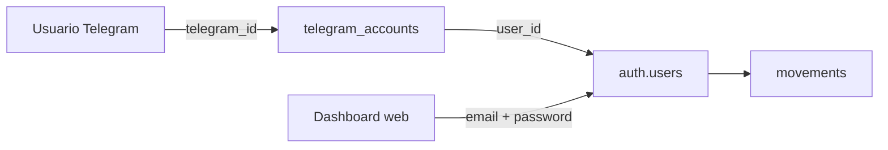

# Cerbero — Vinculación Telegram ↔ Supabase Auth

> Spec para Fase 3 (bot) y Fase 4 (dashboard). Referencia de implementación futura.

---

## Objetivo

Una misma persona puede:

1. Registrar gastos/ingresos desde el **bot de Telegram**
2. Ver y gestionar los mismos datos en el **dashboard web**

Ambos canales comparten el mismo `user_id` de Supabase Auth (`auth.users`).

---

## Modelo de identidad



| Entrada | Identificador |
|---|---|
| Bot Telegram | `telegram_id` (BIGINT, fijo por cuenta Telegram) |
| Dashboard | `auth.users.id` (UUID, Supabase Auth) |

Los movimientos siempre se guardan con `movements.user_id = auth.users.id`.

---

## Tabla de enlace (migración Fase 3)

```sql
CREATE TABLE telegram_accounts (
  id                UUID PRIMARY KEY DEFAULT gen_random_uuid(),
  user_id           UUID NOT NULL REFERENCES auth.users(id) ON DELETE CASCADE,
  telegram_id       BIGINT NOT NULL UNIQUE,
  telegram_username TEXT,
  linked_at         TIMESTAMPTZ NOT NULL DEFAULT NOW()
);

ALTER TABLE telegram_accounts ENABLE ROW LEVEL SECURITY;

CREATE POLICY "users_own_telegram_account" ON telegram_accounts
  FOR ALL USING (auth.uid() = user_id);
```

Opcional para códigos de vinculación temporales:

```sql
CREATE TABLE link_codes (
  id           UUID PRIMARY KEY DEFAULT gen_random_uuid(),
  user_id      UUID NOT NULL REFERENCES auth.users(id) ON DELETE CASCADE,
  code         TEXT NOT NULL UNIQUE,
  expires_at   TIMESTAMPTZ NOT NULL,
  used_at      TIMESTAMPTZ,
  created_at   TIMESTAMPTZ NOT NULL DEFAULT NOW()
);
```

---

## Flujos de vinculación

### Escenario A — Primero la web, luego el bot (recomendado para dev)

1. Usuario se registra en el dashboard (email + contraseña → Supabase Auth).
2. En ajustes: **“Vincular Telegram”** → genera código de 6 dígitos (TTL 10 min).
3. Usuario abre el bot y envía: `/link 482913`
4. Bot valida código, inserta en `telegram_accounts`, marca código como usado.
5. Bot confirma: “Cuenta vinculada. Ya puedes usar /add.”

### Escenario B — Primero el bot, luego la web

1. Usuario envía `/start` al bot.
2. Bot responde con enlace: `https://app.cerbero.com/link?token=<uuid>`
3. Usuario completa registro (email + contraseña) en la web.
4. Al confirmar signup, el backend asocia `token` → `telegram_id` + `user_id`.
5. Bot recibe notificación (polling/webhook) y confirma por Telegram.

### Comportamiento sin vincular

**Decisión:** bloquear comandos de datos hasta vincular.

| Comando | Sin vincular | Vinculado |
|---|---|---|
| `/start` | Mensaje de bienvenida + instrucciones | Mensaje de bienvenida |
| `/link` | Proceso de vinculación | “Ya estás vinculado” |
| `/add`, `/last`, `/month` | “Vincula tu cuenta primero: …” | Funciona |

---

## Bot → API (no Supabase directo)

El bot **nunca** llama a Supabase directamente. Siempre pasa por los **mismos services** que la API REST:

```
Telegram → Telegraf handler → MovementService → MovementRepository → Supabase
Dashboard → Hono route      → MovementService → MovementRepository → Supabase
```

Para operaciones del bot con usuario vinculado:

1. Middleware `bot/auth.ts` resuelve `telegram_id` → `user_id` vía `telegram_accounts`.
2. El service recibe `userId` explícito.
3. Repository usa cliente Supabase con contexto de usuario o service role **solo** con `user_id` verificado del enlace.

---

## Variables de entorno (bot)

```env
TELEGRAM_BOT_TOKEN=          # De @BotFather — ya configurado
SUPABASE_URL=
SUPABASE_SERVICE_ROLE_KEY=   # Solo backend, nunca frontend
PORT=3001
```

Setup BotFather (opcional):

```
/setdescription — Tracker de gastos e ingresos personal
/setcommands
  start - Iniciar y vincular cuenta
  link - Vincular cuenta existente con código
  add - Añadir gasto o ingreso
  last - Últimos 5 movimientos
  month - Resumen del mes
  cancel - Cancelar flujo activo
```

---

## Desarrollo local

1. API corriendo: `bun run dev` en `apps/api`
2. Bot en polling (Telegraf) con `TELEGRAM_BOT_TOKEN`
3. Tu cuenta personal de Telegram habla con el bot (no hace falta cuenta especial)
4. Tras vincular, movimientos visibles en Supabase con tu `user_id`

**Local:** polling. **Producción (Railway):** webhook HTTPS.

---

## Seguridad

- `TELEGRAM_BOT_TOKEN` y `SUPABASE_SERVICE_ROLE_KEY` solo en backend.
- Códigos de vinculación: corta duración, un solo uso, rate limit en `/link`.
- Validar que un `telegram_id` no se vincule a dos `user_id` distintos.
- RLS sigue siendo la capa de seguridad en `movements`; el enlace solo determina **qué** `user_id` usa el bot.

---

## Orden de implementación

| Fase | Entregable |
|---|---|
| **Fase 2** (actual) | API REST + auth JWT — base para bot y dashboard |
| **Fase 3** | Bot Telegraf, migración `telegram_accounts`, `/link`, wizard `/add` |
| **Fase 4** | Dashboard auth, pantalla “Vincular Telegram”, generación de códigos |

---

## Endpoints API futuros (Fase 3/4)

| Método | Ruta | Descripción |
|---|---|---|
| `POST` | `/link-codes` | Genera código de vinculación (auth JWT) |
| `POST` | `/telegram/link` | Valida código + `telegram_id` (llamado por bot internamente o vía service) |
| `GET` | `/telegram/status` | Estado de vinculación del usuario autenticado |

Estos endpoints se implementan en Fase 3/4; la Fase 2 prepara la base (`apps/api`, services, auth JWT).
